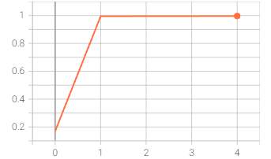
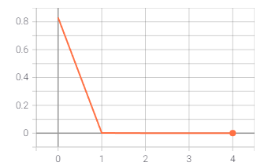
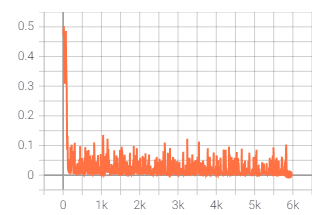
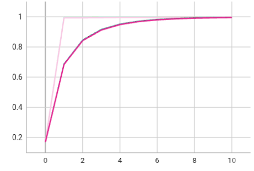
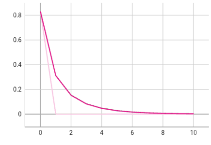
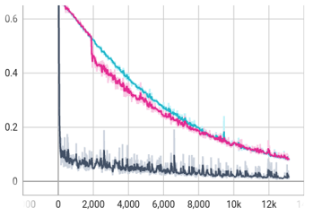

Detection  XSS  with Deep Learning 
====

* 环境

> pytorch=1.71
>
> cuda 10.2

* 新增
> 1. 2021/12/16：把模型放到了model文件夹，测试验证训练放到了一个文件中
> 2. 2021/12/15：新增可以训练集测试集验证集划分，训练、验证、测试比例0.6:0.2:0.2，见my_process.py 第66、67行，训练和非训练集划分比例0.6:0.4，非训练集中测试集、验证集比例0.5:0.5。
> 3. 2021/12/20：把代码统一划分在codes文件夹下，dataProcess中为数据处理的脚本，models为我们搭建的模型，my_dataset是我们的数据集脚本，trainAndValid脚本用于训练和验证（注：plot的绘制和结果暂时未加入该脚本，后续添加）。

* 说明

> 1. data目录下是使用的数据，包括一个从xssed.com爬取的payload和一个正样本payload。
> 2. file目录保存训练好的词向量、预处理的数据、训练好的模型等。
> 3. log目录保存训练日志，可用tensorborad可视化。
> 4. codes下为我们的代码。
> 5. checkpoint下保存我们的模型。

* RUN

> 1. 运行 word2vec_ginsim.py训练嵌入式词向量
> 2. 运行my_processing.py预处理数据，生成训练数据和测试数据。
> 3. 运行trainAndvalid.py，将模型换成mlp、cnn等模型，进行训练和验证。

* mlp效果
>1. 测试集上正确率0.996、测试集上误分（误分我的理解是原本是正常的访问，但是分类成异常访问）率6e-4
>
>2. 一些精度曲线，测试集的正确率曲线和误分率曲线横坐标都是epoch，每一个epoch会把训练集（大概16万样本都过一次）
>
>   - 测试集正确率曲线
>
> 
>
>   - 测试集误分率曲线
>
> 
>
>   - 训练集loss曲线
>
> 

* lstm效果

>1. lstm试了三个超参数，精度如下表，精度比MLP略好一点，模型大小将降低了很多，MLP大概100MB，
>
>|  模型参数   | 验证集精度 | 验证集误报率 |
>| :---------: | :--------: | :----------: |
>| 2层双向LSTM |   0.9978   |     5e-4     |
>| 2层单向LSTM |   0.9969   |     9e-4     |
>| 1层双向LSTM |   0.9972   |     4e-4     |
>
>
>
>1. 测试集20epoch后测试集精度0.9978，误报率8e-4，但是mlp中只跑了4epoch，如果只跑4epoch的话，精度应该还没mlp高，模型大小倒是降低了，mlp 117MB，lstm才最大的2层双向LSTM才88MB
>
>
验证集的精度与测试集精度一样没差多少，所以曲线很接近，这是一次实验的结果没有进行多次实验。深蓝色的是2层双向LSTM、红色的是2层单向LSTM、青色的是单层LSTM，关于Loss存在差异而精度差别不大的愿因可能是这是一个二分类问题，所以只要一个类别超过0.5那就会被当作这类，但是即使分类正确loss还可以继续下降。

>
>  - 验证集精度
>
>
>
>  - 验证集误报率
>
>
>
>  -  训练集loss
>
>
>
>

* cnn效果
> /

* 问题
>1. ~~没有严格按照训练集、验证集、测试集进行划分~~
>2. ~~可以使用lstm这种时序的模型，或许可以提高精度~~，精度略有提升

